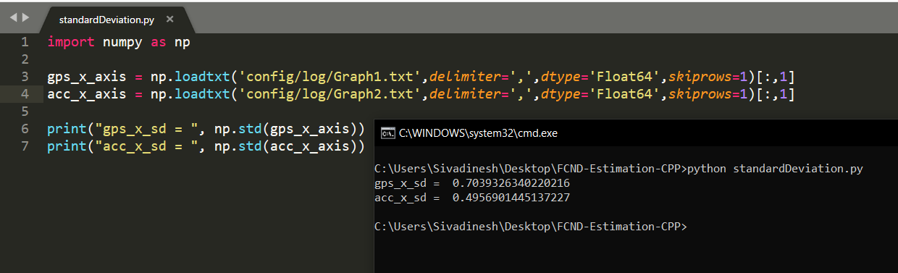
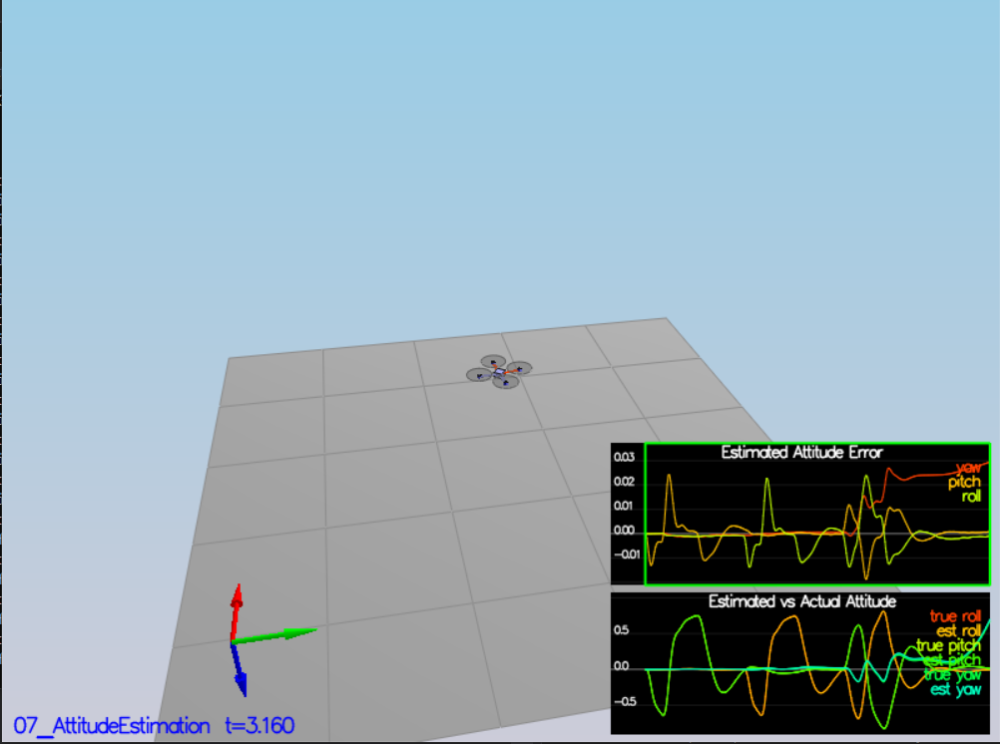
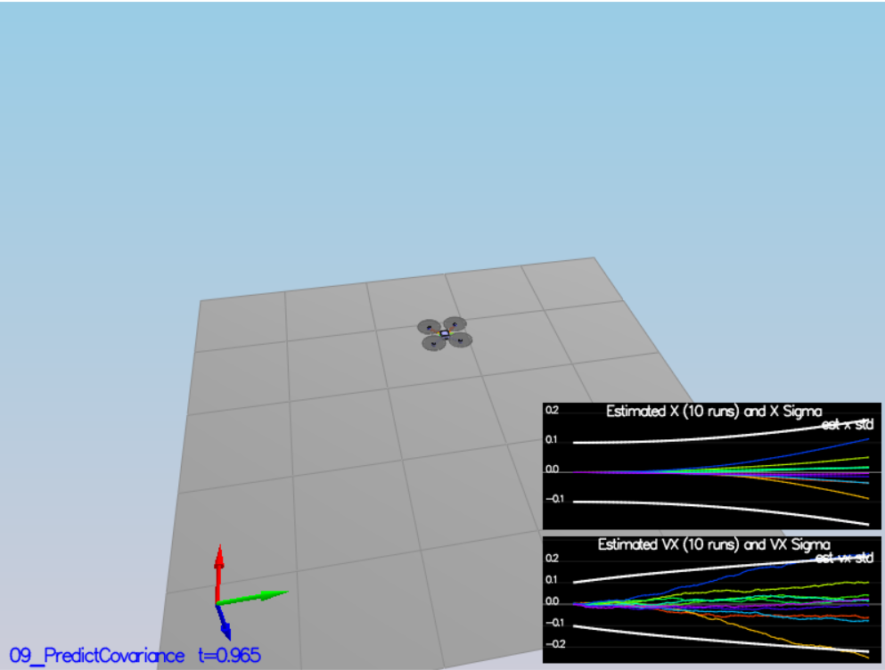
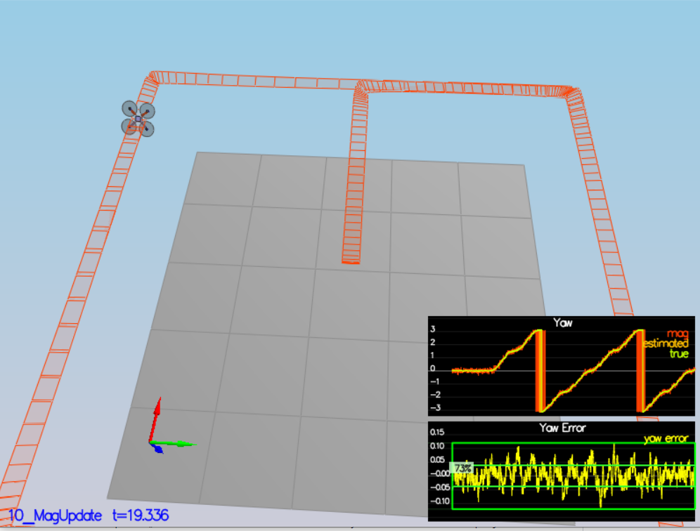
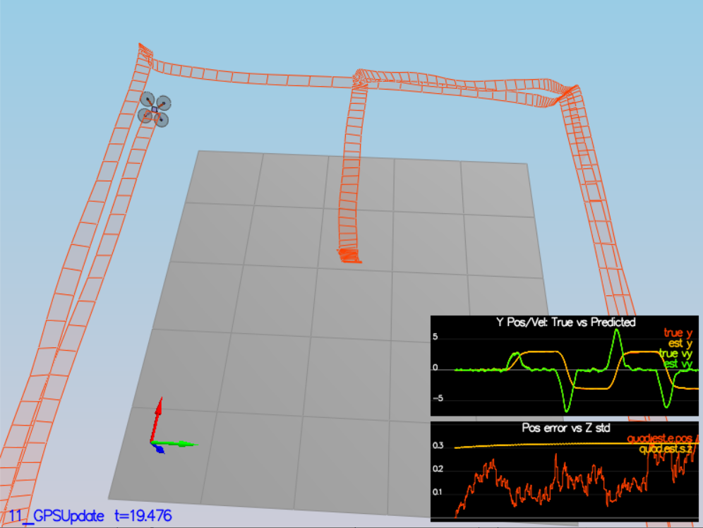

## Project: Building an Estimator

---
### Writeup   

The current writeup.md file that you are reading is my writeup for how i overcame each tasks. 

### Implementing the estimator

#### Task 1: Sensor Noise

Initially I ran the particular scenario and then in order to calculate the standard deviation of x axis in gps from Graph1.txt file and in accelerometer from Graph2.txt. I wrote a python script *standardDeviation.py* which calculates and print the standard deviation using the numpy library. Those values were rounded off to 4 digits after decimal and updated in 06_SensorNoise.txt config file. And thus it passed the Task 1. Basically I parsed the values and appended it as list and then converted it into numpy array. Those numpy.std() calculates standard deviation from array.

---

#### Task 2: Attitude Estimation

* In the QuadEstimatorEKF.cpp file, the angular velocity corresponding to the body frame obtained from the IMU are converted corresponding to the inertial frame using the rotational matrix transformation in the UpdateFromIMU function.
* These values were used to integrate the current roll, pitch and yaw angles for the time duration of dtIMU and then the yaw angle is normalised to lie inbetween -pi and +pi.

Since the attitude estimator is within 0.1 rad for each of the Euler angles for at least 3 seconds, it passed the Task 2.

---

#### Task 3: Prediction Step

To complete the prediction step, I updated three functions:

* *PredictState()* - updates the current state. It performs double integration on the x,y and z axis acceleration to calculate the new velocity and position.

* *GetRbgPrime()*  - calculates the RbgPrime 3x3 matrix using the current roll pitch and yaw values.
* *Predict()*      - prediction steps of the Extended Kalman filter. It updates the covariance using RbgPrime and gprime matrices.

I also updated the QPosXYStd and the QVelXYStd values since it is being used.

---

#### Task 4: Magnetometer Update

Basically UpdateFromMag function is responsible for updating the magnetometer values. The yaw error is calculated as the difference between the yaw value given by the sensor and the zFromX value. The yaw value is normalised to lie inbetween -pi and pi, just like the one we did it in gyro (Task 2). The hprime vector's last value is updated as 1 and the zFromX value is set as the yaw value in ekfState. Also tuned the QYawStd value.

---

#### Task 5: Closed Loop + GPS Update

* Initially commented SimIMU.AccelStd and SimIMU.GyroStd in config/11_GPSUpdate.txt file.

* In UpdateFromGPS function, the z value is updated with gps sensor measurements. these values are sent to the Update() function. The flight evaluation was perfect thus the Extended Kalman Filter is implemented.

---

#### Task 6: Adding Your Controller

* Then the controller coded in my previous project, is replaced here. 
* Then I started testing it in all scenarios. 
* Every scenarios were passed but in Magnetometer update scenario failed due to the excess path overflow of the waypoint. 
* Then reduced the velocity and passed in all the scenarios.
