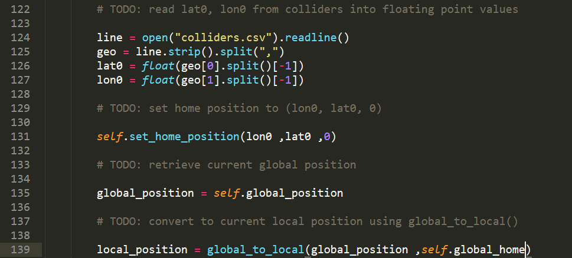
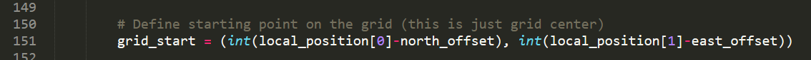
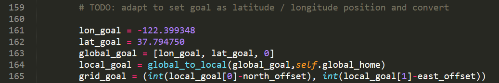
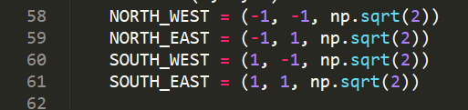
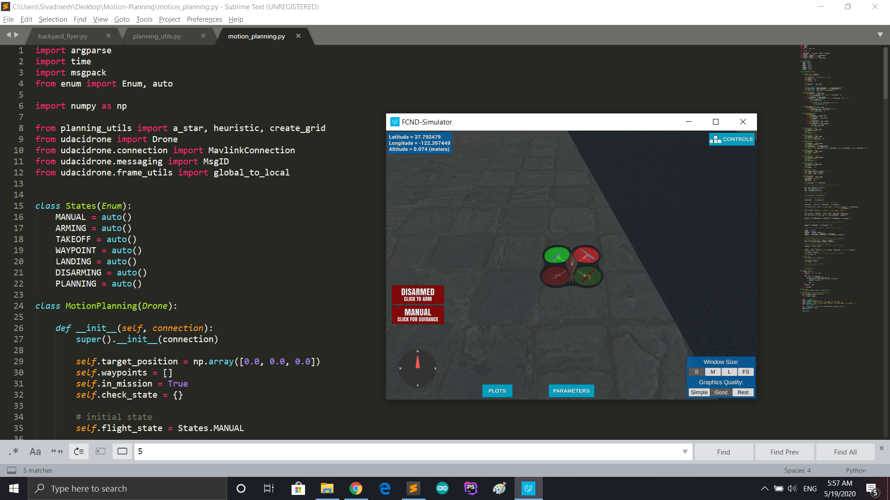

## Project: 3D Motion Planning

---

---
### Writeup 

#### 1. A Writeup that includes all the rubric points and how I overcame each one of them.  

The current writeup.md file that you are reading is my writeup for how i overcame each task. 

### Explain the Starter Code

#### 1. Explain the functionality of what's provided in `motion_planning.py` and `planning_utils.py`

Based on my undertanding of the starter code:

* Initially the flying car takesoff at the center of the map.
* By deafult this is the global home and it is the starting point.
* A path is calculated using A-star algorithm.
* Thus the waypoint is calculated.
* Since the goal is 10 meters north and 10 meters east from the starting point, the flying car followed the calculated waypoints and moved in a zig-zag way to reach the goal.

### Implementing Your Path Planning Algorithm

#### 1. Set your global home position
Here students should read the first line of the csv file, extract lat0 and lon0 as floating point values and use the self.set_home_position() method to set global home. Explain briefly how you accomplished this in your code.

* Basically here i have read the colliders.csv file.
* Then obtained the lat0 and lon0 values by parsing it.
* Then the home position is set using the lat0 and lon0 with altitude as 0.

#### The above codes is in the line 124 to 135 in motion_planning.py file

#### 2. Set your current local position

Then global position of the flying car was obtained and converted to local position using global_to_local function.

#### The above codes is in the line 135 to 139 in motion_planning.py file

#### 3. Set grid start position from local position

The local position obtained here is with reference to the global home position. Thus added the negative offsets of North and East with the local position.

#### The above codes is in the line 151 in motion_planning.py file

#### 4. Set grid goal position from geodetic coords

* Here I have declared two variables for latitude and longitude. 
* Then converted it into the geodetic format.
* Further they are converted into NED coordinates because we need NED coordinates to calculate motion planning.

#### The above codes is in the line 161 to 165 in motion_planning.py file

#### 5. Modify A* to include diagonal motion (or replace A* altogether)

To add the diagonal motions in the grid, new actions (diagonal path movement) are included at the cost of square root of 2 (used np.sqrt) and updated the valid actions if-else ways. 

#### 6. Cull waypoints 

* Then used collinearity concept for pruning unnecessary waypoints to got rid of the additional waypoints on the straight line.
* Then pruned path before converting path to waypoints and used pruned path to find the new waypoints.

### Execute the flight

Yeah it worked well. Moreover I just wanted to check whether the flying car moves exacty through the path, so to avoid the momentum on reaching a waypoint I added time.sleep(3) to waypoint_transition function and it followed exacly the same path. Below I have attached the working video.

 
I also thought about taking up extra challenges later.
